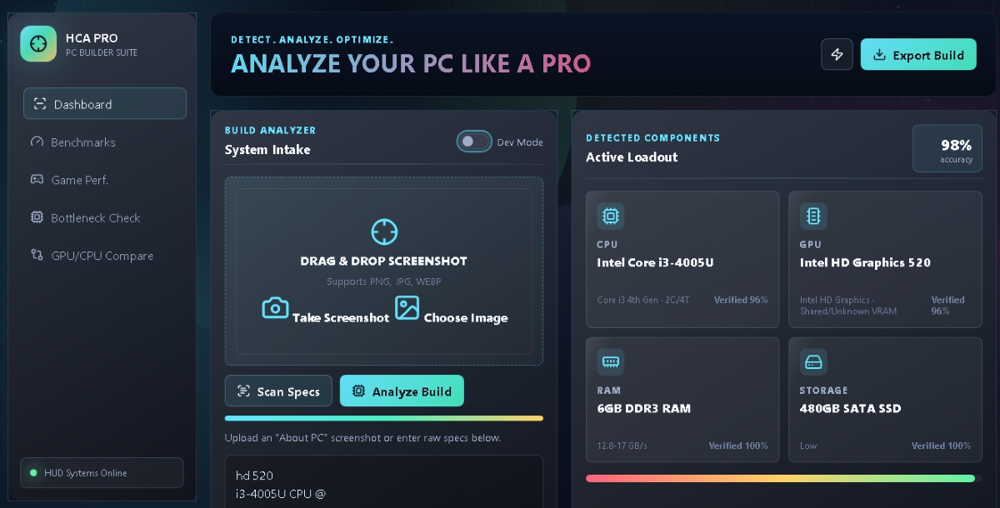

# Hardware Conflict Analyzer Pro v2.0 🚀

> A modern browser-based hardware analysis suite featuring OCR-powered hardware detection, performance evaluation, game compatibility analysis, bottleneck detection, upgrade recommendations, and head-to-head PC comparison.


---

# 🌐 Live Demo

**Website**

https://sm910-tech.github.io/hardware-conflict-analyzer-v2/

---

# 📸 Preview



---

# ✨ Features

| Feature | Status |
|---------|:------:|
| OCR Hardware Detection | ✅ |
| CPU Detection | ✅ |
| GPU Detection | ✅ |
| RAM Detection | ✅ |
| Storage Detection | ✅ |
| Performance Scoring | ✅ |
| Game Compatibility | ✅ |
| Hardware Comparison | ✅ |
| Upgrade Advisor | ✅ |
| PDF Report Export | ✅ |
| Responsive Design | ✅ |
| Progressive Web App (PWA) | ✅ |

---

# 🔍 What It Does

Hardware Conflict Analyzer Pro helps users analyze their computer hardware directly from screenshots or manually entered specifications.

The application automatically:

- Detects CPU, GPU, RAM and Storage
- Performs OCR using Tesseract.js
- Generates hardware confidence scores
- Estimates gaming performance
- Detects hardware bottlenecks
- Suggests upgrade paths
- Compares two complete PC configurations
- Exports professional PDF reports

Everything runs directly inside the browser.

No installation required.

---

# 🔒 Privacy First

- 100% Browser Processing
- No backend server
- No account required
- No hardware data stored
- OCR processing performed locally whenever supported

---

# ⚡ Performance

- Fast OCR Engine
- Lightweight Hardware Database
- Responsive Interface
- Mobile Friendly
- Works on modern browsers

---

# 📊 Database

Current project includes:

- 300+ CPUs
- 300+ GPUs & iGPUs
- 60+ Popular Games
- RAM Database
- Storage Database

---

# 🎮 Main Modules

## OCR Detection

Detect hardware directly from screenshots.

## Hardware Analysis

Analyze CPU, GPU, RAM and Storage.

## Performance Radar

Generate Gaming, Productivity and Overall performance scores.

## Game Compatibility

Check whether popular games can run on the detected hardware.

## Upgrade Advisor

Receive upgrade recommendations based on detected bottlenecks.

## Head-to-Head Compare

Compare two complete PC configurations side-by-side.

## PDF Export

Generate downloadable hardware reports.

---

# 🛠 Technologies Used

### Frontend

- HTML5
- CSS3
- JavaScript (ES6)

### Libraries

- Tesseract.js
- jsPDF
- Lucide Icons

### Deployment

- GitHub Pages

### SEO

- Schema.org
- Sitemap.xml
- Robots.txt

---

# 📁 Project Structure

```
hardware-conflict-analyzer-v2/

│── index.html
│── styles.css
│── app.js
│── preview.png
│── manifest.json
│── robots.txt
│── sitemap.xml
│── about.html
│── contact.html
│── privacy.html
│── terms.html
│── license.html
│── database/
│   ├── cpus.js
│   ├── gpus.js
│   ├── ram.js
│   ├── storage.js
│   └── games.js
```

---

# 📈 Roadmap

### Completed

- OCR Detection
- Hardware Database
- Game Compatibility
- PDF Export
- Responsive UI
- Hardware Comparison
- Upgrade Advisor

### Future Plans

- Larger Hardware Database
- More Games
- Live Benchmark Charts
- FPS Estimator
- Cloud Sync
- AI Recommendations

---

# 📜 License

This project is distributed under a **Commercial License**.

See:

license.html

---

# 📬 Contact

Business Inquiries

- Software Licensing
- Commercial Purchase
- Source Code Purchase
- Feature Requests
- Bug Reports

Website

https://sm910-tech.github.io/hardware-conflict-analyzer-v2/

GitHub

https://github.com/SM910-Tech/hardware-conflict-analyzer-v2

---

# ⭐ Support

If you find this project useful, consider starring the repository on GitHub.

---

© 2026 SM910-Tech | Hardware Conflict Analyzer Pro
